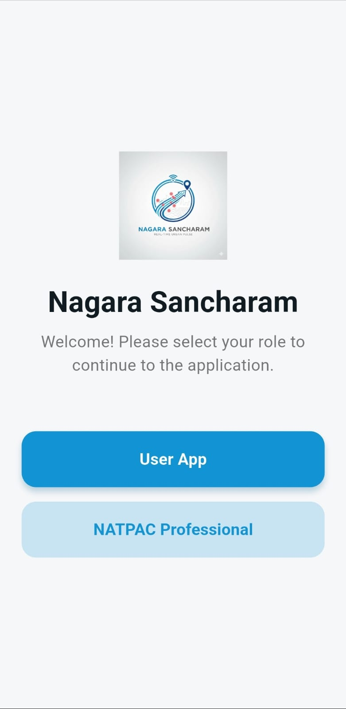
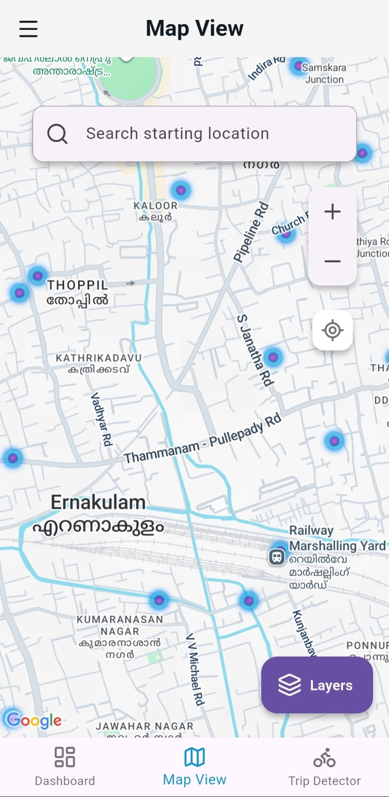
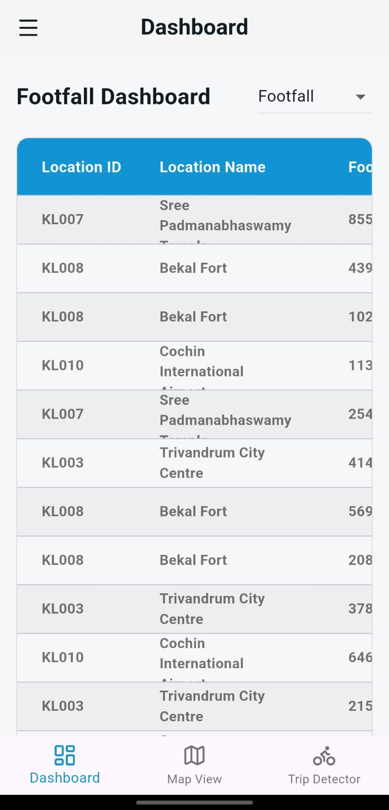
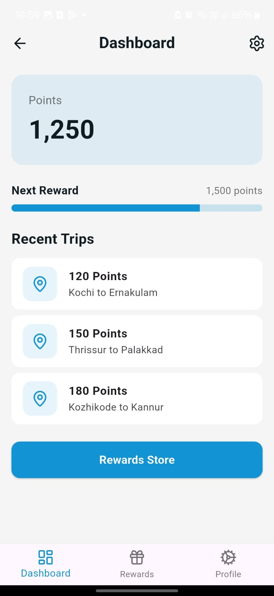
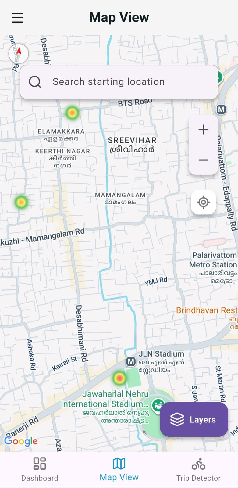
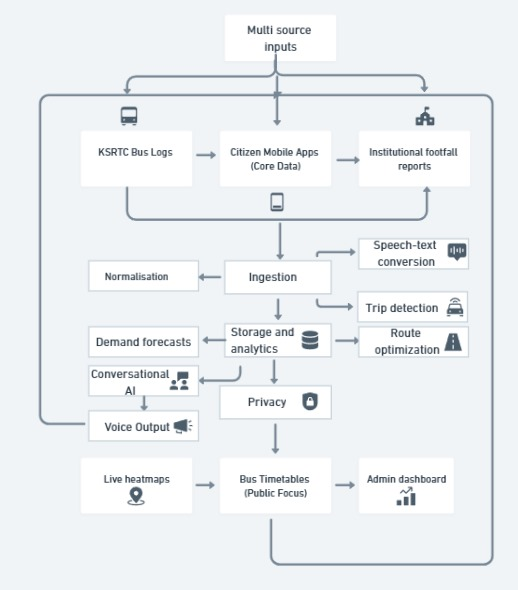

<<<<<<< HEAD
# mobility_sense

A new Flutter project.
=======
# NagaraSancharam
>>>>>>> 02075835786285c953429092d3f07541f1cacbde
# NagaraSancharam

## Problem Statement
**Problem Statement ID:** 25082  
**Problem Statement Title:** Development of a travel related software app that can be installed on mobile phones that could capture trip related information  

### Background
NATPAC requires accurate data for transportation planning, but manual household surveys are time-consuming, tedious, and cover only a very small percentage of the population. This makes the planning exercise inadequate.

### Description
The objective is to develop a travel-related software application for mobile phones to capture trip information. With user consent, the app should automatically detect some travel details and nudge the user to fill in the rest. This will help establish a comprehensive travel activity and trip chain for individuals.

### Expected Solution
A software application that captures complete trip details and saves them to a server/database accessible by NATPAC scientists for planning purposes. The app should be able to capture the following information:
- Trip number  
- Origin (lat, long) and start time  
- Destination (lat, long) and end time  
- Mode used  
- Travel distance  
- Trip purpose  
- Number of companions during the trip  
- Frequency and cost incurred  

**Organization:** Government of Kerala  
**Department:** KSCSTE - National Transportation Planning and Research Centre (NATPAC)  
**Category:** Software  
**Theme:** Transportation & Logistics  

---

## Project Description
**NagaraSancharam** is a mobile-first travel survey application designed for **seamless trip data collection**. By combining **automatic trip detection** with **user-friendly manual inputs**, it provides reliable transportation insights for city planning. The app minimizes user effort while maximizing the accuracy of data collected.

---

## Solution & Features
- 📍 **Automatic Trip Detection** – detects origin, destination, and travel mode using phone sensors.  
- 📝 **Smart Nudges** – prompts users to confirm or add missing trip details.  
- ☁️ **Cloud Integration** – securely syncs trip data with the central NATPAC server.  
- 📊 **Comprehensive Data** – captures trip purpose, companions, frequency, cost, and distance.  
- 🔒 **Privacy First** – all data captured only with user consent.  

---

## Tech Stack
- **Frontend (Mobile App):** Flutter  
- **Backend:** Supabase (Postgres DB + Authentication)  
- **APIs & Libraries:** Sensors Plus, Geolocator, ONNX Runtime for AI models  
- **Deployment:** GitHub + Supabase hosting  
- **Other Tools:** Logging, Dart utilities for data processing  

---

## Screenshots / Demo

  

  
  
  
    
  

---

---
